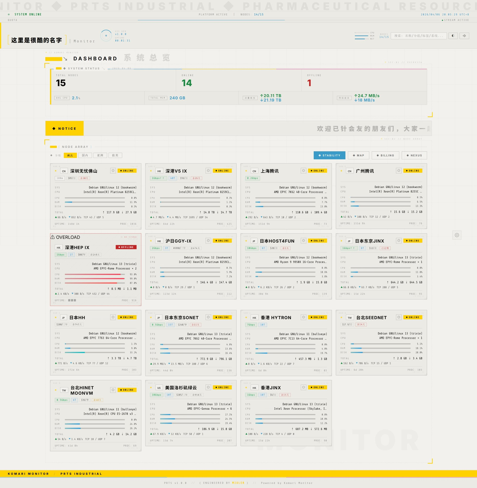
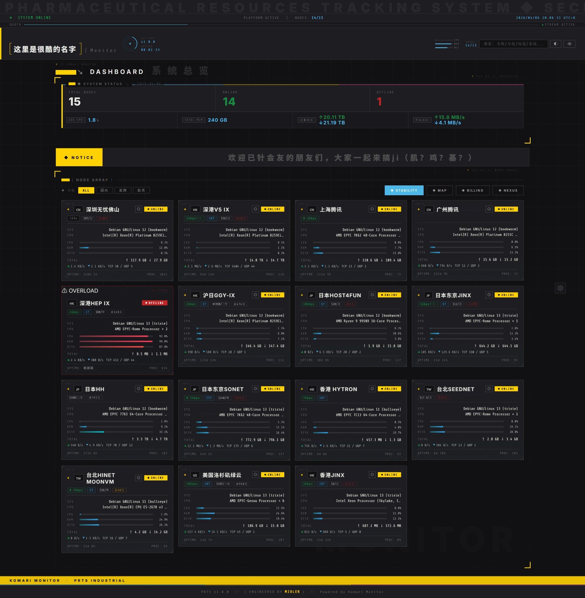
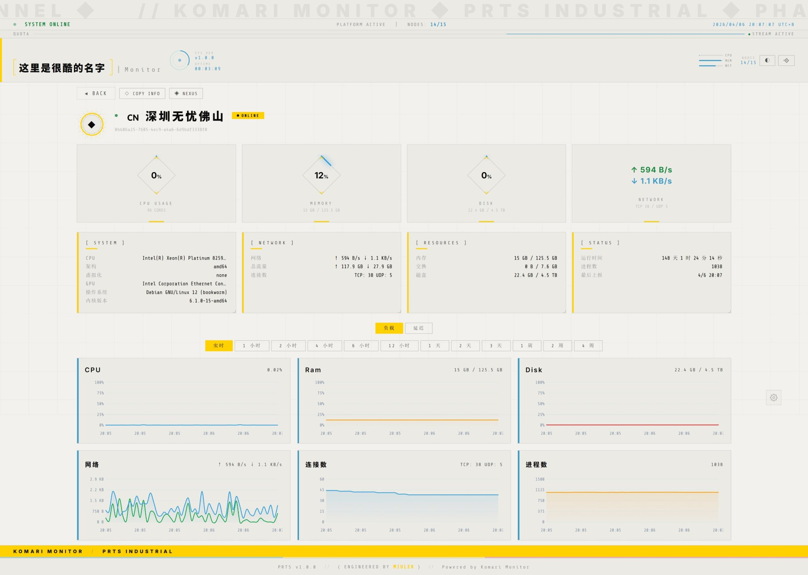
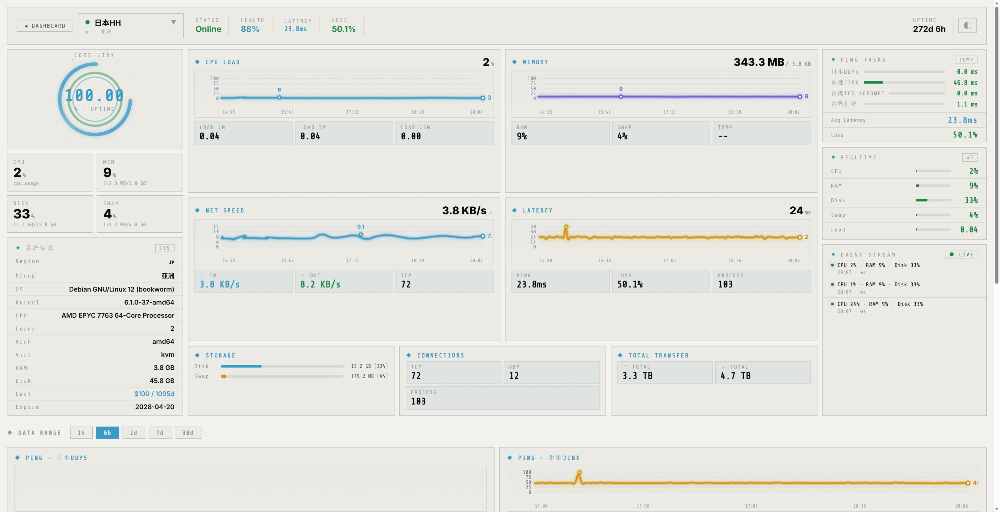
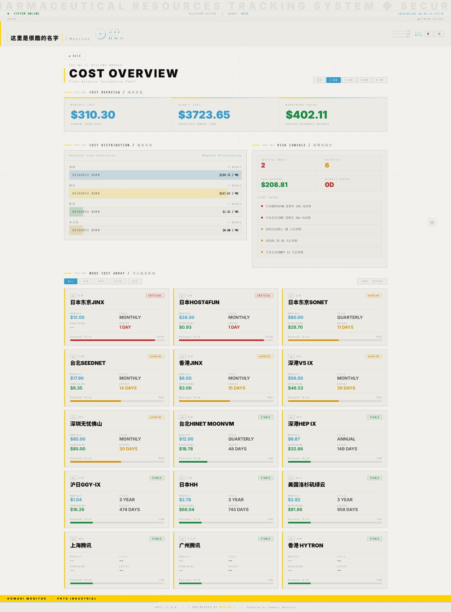

# PRTS Industrial Monitor

A Komari Monitor theme inspired by Arknights' PRTS (Pharmaceutical Resources Tracking System). Industrial HUD aesthetic with dual-color strategy (blue + yellow), dashed boundaries, and structural beauty.

## Screenshots

### Dashboard

### Detail

### Command Nexus

### Billing

## Features

- Industrial HUD dashboard with real-time WebSocket data
- Detail page with charts, system info, and copy-to-clipboard
- Command Nexus cockpit — multi-node chart dashboard with core ring animation
- Billing page — cost overview, regional distribution, risk console, node cost cards
- Stability / Uptime monitor
- World Map — global node distribution
- Visitor IP detection — terminal event card with threat level coloring
- Dark / Light theme toggle
- Dynamic time range based on server retention settings
- Announcement bar support

## Installation

Upload the theme zip in Komari Monitor admin panel.

## Sibling Themes

| Theme | Style | Repo |
|-------|-------|------|
| **PRTS Industrial** (this) | Industrial HUD — Endfield structural beauty | — |
| **NanoMuse** | Anime HUD — Light sci-fi white porcelain | [komari-nano-muse](https://github.com/saladinxp/komari-nano-muse) |

## Credits

Engineered by [Miuler](https://github.com/saladinxp) · Powered by [Komari Monitor](https://github.com/komari-monitor/komari)
